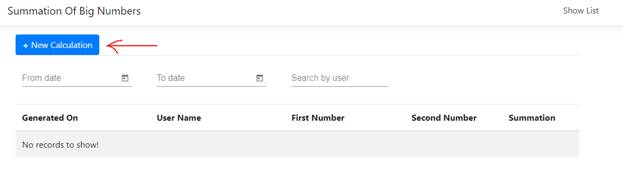
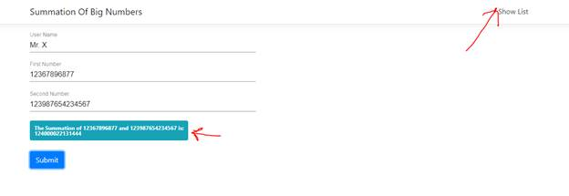
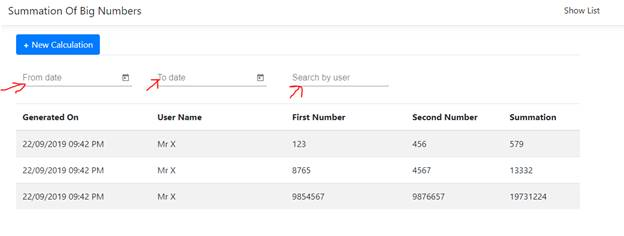

## **Application for adding 2 big numbers, which won't fit to any .NET type**

This is a application for adding two big numbers which is not fit any .net data type. To run this application need some prerequisite that is mansion as below.  

**Prerequisite:**
* Visual Studio 2019 
* .Net Core 2.2 SDK
* EntityFrameworkCore 
* Angular 6.
* Bootstarp 4 
* Angular Material 6
* SQL SQLEXPRESS 13.0.4

**Installation and Configuration**
* Clone Prjocet
* Restore “DBNumberAddition.bak” file in SQL Server that is provided with this application. 
* Open the solution with Visual Studio 2019 
* Change the connection string on ‘appsettings.json’ with your Data Source, User Id and Password. 
* Build the solution and run application.

**Quick Overview**

Press New Collection button to add numbers

New window will appear and fill the form and press Submit button. Result will show on that page. To show all result click on  “Show list” link

The list can be sort by pressing the header of the column and it can also filtered by date range and user name. the filter text box is above the list

